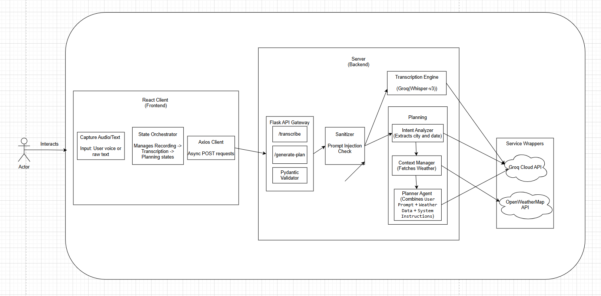
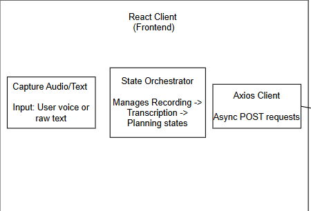
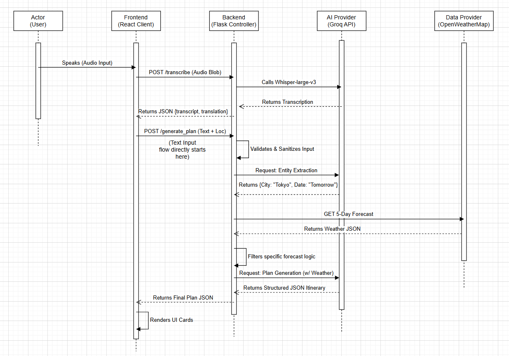

# KAZE AI (風)

This repository contains the source code for **KAZE AI**, a context-aware voice concierge that combines ultra-fast generative AI with live weather intelligence to transform simple spoken requests into actionable, weather-proof itineraries.

-----

## 🛠 Tech Stack

  - **Backend**: Python (Flask)
      - **Dependencies**:
          - **Groq SDK**: Utilized for both STT (Whisper) and Inference (Llama 3) to achieve near real-time latency via LPU (Language Processing Unit) hardware.
          - **Tenacity**: Implements exponential backoff and retry logic for robust API stability.
          - **Pydantic**: Enforces strict schema validation for the LLM's JSON output, ensuring the frontend never breaks due to malformed data.
          - **Flask-CORS**: Manages Cross-Origin Resource Sharing for secure client-server communication.
  - **Frontend**: React (Vite)
      - **Dependencies**:
          - **Framer Motion**: Powering the fluid, glassmorphic UI transitions and state visualizations.
          - **TailwindCSS**: Utility-first styling for a responsive design.
          - **Lucide React**: Lightweight, consistent iconography.
          - **Axios**: Handling asynchronous HTTP requests and interceptors.
  - **External Services**:
      - **Groq API**: Chosen over standard GPUs for its deterministic latency, essential for a conversational voice interface.
      - **OpenWeatherMap**: Provides the "Ground Truth" data (5-Day Forecast) that grounds the AI's hallucinations in reality.

-----

## ⚙️ Local Setup Instructions

Follow these steps to get the project running on your local machine.

### 1\. Prerequisites

Ensure you have the following software installed on your system:

  - Git
  - Python 3.9 or newer
  - Node.js v18 or newer
  - npm or yarn

### 2\. Clone the Repository

```bash
git clone https://github.com/n3utr7no/Kaze-AI.git
cd Kaze-AI
```

### 3\. Backend Setup

Navigate to the backend directory and set up the Python environment.

```bash
# Create virtual environment
python -m venv venv
source venv/bin/activate  # On Windows: venv\Scripts\activate

# Install dependencies
pip install -r requirements.txt
```

Create a `.env` file in the root directory:

```env
GROQ_API_KEY=your_groq_api_key
WEATHER_API_KEY=your_openweathermap_api_key
```

### 4\. Frontend Setup

Navigate to the frontend directory (if separated) or install from root.

```bash
npm install
```

Create a `.env` file for the frontend to point to your Flask server:

```env
VITE_API_URL=http://localhost:5001
```

### 5\. Run the Development Servers

**Backend (Terminal 1):**

```bash
python app.py
# Runs on http://localhost:5001
```

**Frontend (Terminal 2):**

```bash
npm run dev
# Runs on http://localhost:5173
```

### 6\. Access the Application

Once the servers are running, you can access the application at: [http://localhost:5173](https://www.google.com/search?q=http://localhost:5173)

-----

## Architecture

### Below is a high-level architecture diagram of the system's Context-Aware Pipeline:

> 
> **

-----

## Key Features

### 1\. Browser-Agnostic Audio Ingestion

In a real-world browser environment, audio encoding is fragmented (Safari uses MP4/AAC, Chrome uses WebM/Opus). My approach abstracts this complexity in the `Browser APIs Wrapper`. The frontend dynamically detects the browser engine and packages the binary blob correctly. The backend `Transcription Engine` then handles the file I/O to stream this blob to Groq's Whisper-v3 model, ensuring high-fidelity Japanese transcription regardless of the user's device.

> 
> **

-----

### 2\. Agentic Reasoning Pipeline (RAG)

Unlike standard chatbots that hallucinate answers immediately, KAZE AI implements a multi-stage reasoning pipeline.

1.  **Intent Extraction:** The system first calls an LLM to strictly extract the `Target City` and `Date Offset` (e.g., converting "next Friday" to `YYYY-MM-DD`).
2.  **Tool Use:** It then acts as an agent, pausing execution to query the OpenWeatherMap API for that specific location and time window.
3.  **Context Injection:** The precise weather data (e.g., "Heavy Rain, 19°C") is injected into the System Prompt for the final generation phase.

This ensures the advice is physically possible (e.g., suggesting indoor museums instead of beaches during rain).

> 
> **

-----

### 3\. Stateless Security & Validation

To ensure the application is secure by default, the architecture includes a `Sanitizer` middleware that runs heuristic checks against Prompt Injection attacks (e.g., "Ignore previous instructions") before the LLM ever sees the input. Furthermore, the `Planner Agent` utilizes **Pydantic** to enforce a strict JSON schema on the output. If the LLM generates conversational fluff instead of JSON, the validation layer catches it, protecting the frontend from rendering errors.

-----

## Project Structure

The project is designed with a clear separation between the Client (Presentation) and the Server (Logic).

### Frontend (`src/`)

  - **`App.jsx`**: The main State Machine. Manages the lifecycle of `idle` -\> `recording` -\> `transcribing` -\> `planning`.
  - **`components/`**: (If applicable) Contains the reusable UI cards for rendering itineraries.
  - **`assets/`**: Static assets and icons.

### Backend (`app.py`)

  - **Flask API Gateway**: Routes requests to specific logic handlers.
  - **Logic Core**:
      - `call_llm()`: Wrapper for Groq interactions with retry logic.
      - `get_weather_forecast()`: The tool-use function for external data retrieval.
      - `generate_plan()`: The orchestrator that binds NLU, Tools, and Generation together.

-----

## Assumptions and Limitations

### Assumptions

  - **Geolocation Permissions:** The application assumes the user will grant browser geolocation permissions. If denied, it defaults to a fallback location (Tokyo) rather than failing.
  - **Single-Turn Logic:** The current architecture is optimized for "One-Shot" planning. While it passes history for context, the rigorous weather checking happens primarily on the current prompt.
  - **Audio Environment:** Assumes a relatively quiet environment for Whisper-v3 to accurately transcribe Japanese phonetics.

### Limitations

  - **Session Persistence:**
      - The chat history is held in the React state (memory). Reloading the browser wipes the conversation context. A future update could implement `localStorage` or a database.
  - **Complex Date Parsing:**
      - The current entity extractor handles relative dates ("tomorrow", "next week") well, but may struggle with highly complex temporal queries ("the second Tuesday of next month").
  - **Rate Limiting:**
      - Relies on the free tier of Groq and OpenWeatherMap, which restricts the number of concurrent requests per minute.


```Live
https://kaze-ai.vercel.app/
```